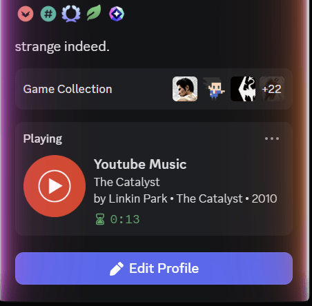

##### YouTube Music Discord RPC

##### Overview

##### 

##### This project syncs your YouTube Music playback directly to your Discord status through a Node.js bridge and a browser extension. It provides full support for Firefox browser.

##### Core Features

##### 

##### The system performs live synchronization of song titles and artist names. It includes a smart timer that calculates elapsed and remaining playback time. The status updates or clears automatically when music is paused. The entire build is optimized for extremely low CPU and RAM consumption.

##### Node.js Setup

##### 

##### Begin by cloning the repository to your local machine. Open a terminal window inside the /server directory. Execute the npm install command to download the necessary dependencies. Launch the bridge by running node server.js.

##### Firefox Installation

##### 

##### Navigate to the about:debugging page in your browser. Click on the This Firefox option in the sidebar. Select the Load Temporary Add-on button and choose the manifest.json file from your project folder.

##### Requirements

##### 

##### The latest Node.js LTS version is required for the server. The Discord Desktop application must be running on your system. You must also have the Activity Status setting enabled within your Discord user profile.

